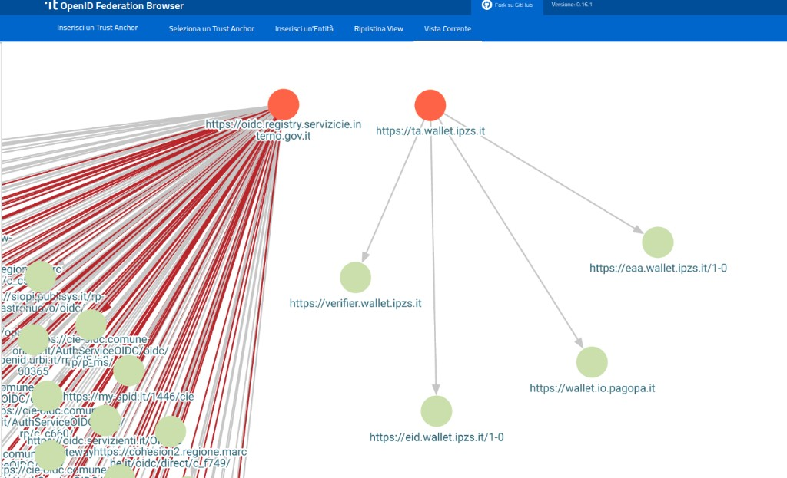

<!-- _class: lead lead-blue lead-title-tight -->
# Case Study: Italian Federation for Wallet Architectures

**10 minutes** on how Italy deployed **OpenID Federation 1.0** as the national trust plane for **IT-Wallet**.

**with Giuseppe De Marco**, _Technical Project Manager — Dipartimento per la trasformazione digitale, Presidency of the Council of Ministers of Italy_

---

## Agenda

1. **Why Federation** for wallets and Digital Credentials.
2. **How Italy applied it** — Trust Anchor, Intermediaries and Leaves in Wallet Architectures.
3. **What production taught us** — adoption, open specs, coexistence with EU Digital Identity Wallet trusted lists.
4. **What we still feed into the roadmap** — questions and answers.

Today we talk about a **deployed national federation** for credential issuance and presentation, not a greenfield protocol pitch.

---

## The Italian choice

- **One national registrar:** **OpenID Federation 1.0** with a **governmental Trust Anchor**. Leaves: Wallet Providers, Credential Issuers (**PID** / **(Q)EAA** — identity and attribute credentials), Relying Parties. **Multiple wallets** sit under that one registrar — as **national policy** and **EUDI Wallet** both require. **Multiple certification bodies and labs** are allowed.
- **Intermediates are RP-only** (eIDAS Art. 5b(8) intermediaries). Federation *can* nest Wallet Providers under an Intermediate; **Italy does not**. That is **policy**, not a protocol limit.
- **Wallet Instance is not a Federation Entity.** It must **not** publish `/.well-known/openid-federation`. Reliability is a **Wallet Attestation** issued by the Wallet Provider.
- **Reuse, don’t rebuild:** **SPID/CIE** (Italy’s existing eID schemes) for identity proofing, **PDND** (national authentic-source data platform), **App IO** (the public-service app) as the first wallet surface.
- **Two federations, two Trust Anchors:** legacy **SPID/CIE** OpenID Connect still uses **pre-1.0** Federation drafts; **IT-Wallet** is **Federation 1.0**. Retrocompatibility is achievable, given that the standard has evolved in continuity with pre-existing implementations.

---

<!-- _class: topology-slide -->
## Topology — who is in the federation

The Trust Anchor is the **single national registrar**. **Intermediates onboard RPs only** — national policy, not a Federation limit. Leaves self-publish **Entity Configuration**; superiors publish **Subordinate Statements**. Revocation = **stop publishing** a valid statement.

---

<!-- _class: federation-api-compact -->
## What Italian Federation actually carries

| Artefact | Role in IT-Wallet |
|----------|-------------------|
| **Entity Configuration** | Self-issued signed JWT: keys, endpoints, protocol metadata |
| **Subordinate Statement** | Superior attests the leaf — keys, optional **metadata policy**, constraints |
| **Trust Chain** | Leaf EC + statements up to the Trust Anchor; **offline-verifiable** with TA keys |
| **Trust Marks** | Compliance / role (e.g. RP, RP Intermediary, issuer, wallet solution) |
| **Historical keys + subordinate events** | Non-repudiation and lifecycle transparency after key rotation / revocation |

Protocol metadata types: `federation_entity` · `wallet_solution` · `openid_credential_issuer` · `oauth_authorization_server` · `openid_credential_verifier`.

Federation APIs are **public** — **no client credentials**. The Trust Anchor does not learn **which wallet** asked about **which RP**.

---

<!-- _class: topology-slide -->
## Runtime — issuance and presentation

- **Issuance:** the Credential Issuer evaluates the **Wallet Provider** chain; the instance presents a **Wallet Attestation** (no personal data).
- **Presentation:** the Wallet evaluates the **RP** chain (or a `trust_chain` in the signed request), then presents the credential. **The issuer does not observe** the transaction.
- **Offline / proximity:** short-lived chains; RP requests **SHOULD** carry `trust_chain`. Freshness is a **TTL** problem, not a new PKI.

---

<!-- _class: domestic-gap-matrix -->
## National Federation next to EU Digital Identity Wallet lists

EU **ARF** (Architecture Reference Framework) and **LoTE** (Lists of Trusted Entities) sit beside the national plane.

| Topic | Italian position |
|------|------------------|
| **Why a national plane** | Commission-hosted PID/EAA Provider / Wallet Provider / Access and Registration Certificate Provider lists do **not** map 1:1 onto **domestic** registration, policy, and lifecycle. |
| **Strategy** | Keep **OpenID Federation** as the **JWT-first national plane**; meet **ARF / LoTE / X.509** obligations **where mandated**. Do not force one stack to emulate the other. |
| **RP signalling** | `openid_federation:` → trust chain + Entity Configuration `sub`. `x509_hash:` → hash of the **RP access certificate**. |
| **X.509 lifecycle** | Once an X.509 is issued, status is **X.509 PKI** (CRL / OCSP) — not Federation fetch. Federation **distributes** keys and certs; it does not replace certificate status. |
| **Convergence** | On **what verifiers can prove**, not on collapsing every list into one protocol. |

---

<!-- _class: case-stats-slide -->
## Production evidence (Phase 1 — *Documenti su IO*)

> 12M

wallet activations by July 2026

> 10.3M

digital driving licences

> 10.0M

health cards

37%

of active IO users activated the wallet

- **Rollout:** 50k (23 Oct 2024) → 250k → 1M → **universal opening 4 Dec 2024**.
- **Usage (consenting telemetry, ~70%):** **91%** of activators added ≥1 credential; activation funnel **70.8%**; document-add funnel **94.1%**.
- **Open delivery:** CC-0 specs, **150+** test cases, Python / JS·TS references, public **Federation Browser**.

These are **adoption and usage** signals. Fraud, RP cost, and transaction-time econometrics are **not yet** measured at ecosystem scale.

---

<!-- _class: browser-shot-slide -->
## Two federations, one browser — inspect the graph

**Left:** CIE / SPID (Italian eID) OpenID Connect Trust Anchor (pre-1.0, large leaf fan-out). **Right:** IT-Wallet Trust Anchor (`ta.wallet.ipzs.it`, Federation 1.0).

  

Public **Federation Browser** + test matrix: onboarding friction is **visible**, not a private registrar ticket.

---

<!-- _class: lessons-slide -->
## Learnings from deploying Federation for Digital Credentials & Wallet

**What worked**

- **One registrar, many wallets** — Intermediates stay **RP-only** by policy; certification bodies and labs stay **plural**.
- **Public** federation APIs are a **transparency** feature for a large scale deployment with public audience.
- **Progressive ARF alignment** (versioned national profiles) — do not wait for a frozen EU stack to ship a national wallet.
- Harden **`OID-FED-WALLET` in production first**, then feed evidence into the draft — do not productise optional features that are still underspecified.

**What is hard**

- **Moving ARF / implementing acts** while millions are already onboarded.
- **No appetite for “trust proxies”** that re-evaluate foreign lists on behalf of wallets (privacy, single point of failure, cache drift).
- High activation ≠ citizens understanding **selective disclosure**. Private wallet providers enter in **Phase 2** (expected Q3 2026).

---

## Roadmap — what this case hands to Part 2

- **Phase 2:** more credentials, proximity (BLE / NFC), **private Wallet Providers** at the **same national registrar**.
- **Phase 3:** notify the public IT-Wallet as an **EUDI Wallet** — Federation remains the **national** plane; EU lists are **additional** evidence, not a replacement.
- **Standards we are pushing from practice:** [Federation Subordinate Events](https://openid.net/specs/openid-federation-subordinate-events-1_0.html), [Extended Subordinate Listing](https://openid.net/specs/openid-federation-extended-listing-1_0-01.html), [ACME + OpenID Federation](https://datatracker.ietf.org/doc/draft-ietf-acme-openid-federation/), and a possible **federation-scoped registration** analogue to OpenID Connect Dynamic Client Registration.
- **Open questions for Part 2:** due-diligence artefacts, Wallet Architecture draft maturity, how national federations **interwork** without a trust-proxy single point of failure.

Specs: [italia.github.io/eid-wallet-it-docs](https://italia.github.io/eid-wallet-it-docs/versione-corrente/en/) · Trust chapter implements **OpenID Federation 1.0**.

---

<!-- _class: lead lead-blue thank-you-slide -->
# Thank you

**Questions now — or hold them for Part 2.**

<a href="https://peppelinux.github.io/Wallet-Presentations/gdc-italian-federation-vc-wallet/">peppelinux.github.io/Wallet-Presentations/gdc-italian-federation-vc-wallet/</a>

