<!-- _class: lead lead-blue -->
# OpenID Federation 1.0 and EUDIW trusted lists / X.509 PKIs in IT-Wallet

The state of play of two different trust management systems in the Italian IT-Wallet.

**with Giuseppe De Marco**, _Technical Project Manager — Dipartimento per la trasformazione digitale, Presidency of the Council of Ministers of Italy_

---

## Today in 4 parts

1. **OpenID Federation in IT-Wallet** — final alignment with **Federation 1.0**, federation **endpoints**, **national** rollout.  
2. **EUDIW trust management** — overview, responsibility matrix, design concerns, domestic gaps.
3. **Costs** — many sources vs one federation chain; dual evaluation paths; participant obligations.  
4. **Evolution** — onboarding APIs, ACME + Federation, OpenID Federation Wallet Architecture draft maturity, why not “federation trust proxies” over foreign lists.

---

## Part 0 — Legacy SPID/CIE vs IT-Wallet based **Federation 1.0** (short intro)

Two different Federations, using two different Trust Anchors.

pre-1.0 OpenID Federation drafts are used in the the legacy OIDC SPID/CIE profile. 

Even if the overall approach is unchanged, OIDC CIE/SPID should be updated with Federation 1.0 (and OIDC iGov too) assuring retrocompatibility to previous implementations: [spid-cie-oidc-django](https://github.com/italia/spid-cie-oidc-django/pull/324) exemplifies how **retrocompatibility is achievable**.

---

## Part 1 — Profile delta: **metadata** (IT-Wallet / Federation 1.0)

The **national IT-Wallet rules** align with **OpenID Federation 1.0** and the **OpenID Federation Wallet Architecture** draft. 

**Metadata beyond base Federation:** **`federation_entity`** (required); RP **`openid_credential_verifier`**; PID/(Q)EAA providers publish **`openid_credential_issuer`** and (where applicable) **`oauth_authorization_server`** metadata types — **combined** in one entity configuration or **split** across entities (Credential Issuer then carries **`authorization_servers`** pointing at the AS); leaf **`federation_entity`** details such as **`logo_uri` in SVG** and **PEC** in `contacts` where the profile tightens presentation.

**Metadata beyond base Federation Wallet Arch:** **`wallet_solution`** describing a Wallet Provider and its "_sole_" Wallet Solution.

---

## Part 1 — Federation Profile delta in **OpenID4VCI** Metadata

- **`jwks` by value:** **`openid_credential_issuer`** and **`oauth_authorization_server`** both require a **`jwks`** JSON object **carried by value** (with `OID-FED` §5.2.1 / `JWK` references) — national **credential issuer metadata** profile.
- **Issuance flow:** **advertised on `oauth_authorization_server`** (`pushed_authorization_request_endpoint`, **`require_signed_request_object`** = true, **`authorization_endpoint`**); **IT-Wallet** mandates PAR → one-time **`request_uri`** → authorize with **`request_uri`** only (no PAR body replay); **`redirect_uri`** must match the signed Request Object — low-level issuance / authorization-endpoint rules.
- **Further issuer metadata (national profile):** **REQUIRED** — **`trust_frameworks_supported`** (e.g. CIE, eIDAS, L2+document proof) in the authorization flow; per–credential-configuration **`schema_id`** and **`authentic_sources`** (national schema + authentic-source registries); **`status_list_aggregation_endpoint`** (Token Status List aggregation); **SVG**-first **display** rules for issuer and credential artwork where the profile mandates them. **OPTIONAL** — **`batch_credential_issuance`** (and its **`batch_size`** when present).

<!--
**Speaker notes — “Issuance flow” (PAR + request_uri + redirect_uri)**

- **What PAR is:** the wallet does not put the full authorization request on the `/authorize` URL. It **POSTs** that request to the **Pushed Authorization Request (PAR)** endpoint; the issuer answers with a short **`request_uri`** (a handle to the stored request).

- **Why “then authorize with `request_uri` only”:** the next step is to open the authorization UI using **only** that handle (e.g. `GET /authorize?client_id=…&request_uri=…`). You are **not** supposed to **replay** the full PAR body again on the front channel. That way the live authorize step is **tied to exactly what the issuer accepted at PAR time**, and you avoid fat, tamper-friendly URLs.

- **“One-time”:** treat the **`request_uri`** as **single-use / short-lived** in the profile sense — do not recycle it for multiple independent authorization attempts; issue a new PAR when you start a new issuance authorization.

- **`redirect_uri` vs signed Request Object:** the request parameters (including **`redirect_uri`**) live inside a **signed** structure (e.g. JWT Request Object). The rule means: the **`redirect_uri`** the client will actually use **must be the same** as the one **inside that signature**. So an attacker cannot later swap in a different redirect and steal the response at a malicious endpoint — the signature would not match.

- **IT-Wallet:** this is the **national OpenID4VCI issuance / authorization-endpoint** tightening on top of generic OAuth/OIDC patterns — say “Italian profile requires this binding for issuance,” not “OAuth always works this way everywhere.”

- **How this “gets into metadata”:** there is usually **no** separate JSON flag meaning “use PAR” beyond what OAuth already defines. The wallet **discovers** the PAR URL as **`pushed_authorization_request_endpoint`** in **`oauth_authorization_server`** metadata (required in IT-Wallet; see national **Credential Issuer metadata** doc, *Metadata for oauth_authorization_server*). **`require_signed_request_object: true`** is what forces the **signed Request Object** where **`redirect_uri`** is bound. **`openid_credential_issuer`** points at that AS via **`authorization_servers`** (combined or split entity layout — see previous slide bullet), so issuance still sits under “OpenID4VCI metadata” even though PAR lives on the **AS** metadata object.
-->

---

## Part 1 — Federation Profile delta in **OpenID4VP** Metadata

- **Attested URIs:** **`openid_credential_verifier`** (when `client_id` = **`openid_federation`**) carries pre-registered **`request_uris`**, **`response_uris`**, and **`redirect_uris`** so the wallet rejects **endpoint mix-up** (`WP_081`, `WP_091a`, `WP_094a`; remote-presentation test matrix). The same URI lists are defined in **`OID-FED-WALLET`** (draft; checks align with OpenID4VP).

_With **`x509_hash`**, equivalent **`client_metadata`** is carried **in the request** instead._

- **Verifier presentation & privacy:** **`encrypted_response_enc_values_supported`** for **`direct_post.jwt`**, **`logo_uri`** as **SVG**; conditional **`erasure_endpoint`** when the RP requests strongly identifying claims. **`erasure_endpoint`** is **IT-Wallet–specific** (national **relying party / credential verifier** metadata).

---

## Part 1 — The remark about Wallet Instances using OpenID Federation

- **Wallet + federation:** Wallet Instance **must not** publish discoverable online metadata; federation endpoints are all **public without client credentials** that identify callers.

---

## Part 1 — OpenID Federation *Wallet Architectures* (draft)

- Reference: **[OpenID Federation Wallet Architectures 1.0](https://openid.net/specs/openid-federation-wallet-1_0.html)** (draft; cited as **`OID-FED-WALLET`** in the **IT-Wallet standards** list).
- **Wallet Provider entity configuration** in IT-Wallet requires `metadata` to include **`wallet_solution`** and **`federation_entity`**.
- **Issuance path nuance:** PID / (Q)EAA issuance to the wallet follows **OpenID4VCI** flows under the same **IT-Wallet** rules; the **Federation `wallet_solution` metadata** addresses *wallet-solution discovery and typing* in the federation layer, not a replacement for credential-issuer metadata.

---

<!-- _class: federation-api-compact -->
## Part 1 — Federation API surface (Trust Anchor / Intermediate)

| API | HTTP | Roles | Norm | Body |
|-----|------|-------|------|------|
| Entity config | `GET /.well-known/openid-federation` | TA,Int,WP,RP,CI | MUST | `entity-statement+jwt` |
| List | `GET …/list` | TA,Int | MUST | JSON |
| Fetch | `GET …/fetch?sub=` | TA,Int | MUST | JWT |
| TM status | `POST …/trust_mark_status` | TA,Int | **OIDF** SHOULD | JSON |
| TM list | `GET …/trust_marked_list` | TA,Int | **OIDF** MAY → **IT-W** SHOULD | JWT |
| Hist keys | `GET …/historical_keys` | TA,Int | **OIDF** MAY → **IT-W** MUST | JWT |
| Sub events | `GET …/subordinate_events?sub=` | TA,Int | ext. | `entity-events+jwt` |
| Resolve | `federation_resolve_endpoint` | any | **OIDF** MAY (§8.3) | — |

- IT-Wallet uses the **Federation Subordinate Events Endpoint** as defined in **`OID-FED-SUBORDINATE-EVENTS`**: [openid-federation-subordinate-events-1_0](https://openid.net/specs/openid-federation-subordinate-events-1_0.html).  
- Purpose: historical **registration / revocation / JWKS update** events for immediate subordinates — transparency for lifecycle and audits (**Federation Subordinate Events** in the **IT-Wallet** trust model).

---

## Part 1 — Wallet solution selection & custom URI mitigation

- **UX reference:** wallet solution selection page in the national proxy preview — [iam-proxy-italia IT-Wallet preview](https://italia.github.io/iam-proxy-italia/preview/sec-fix-3.2.1/it-wallet.html) (domestic pattern for presenting available wallet solutions to the user).  
- **Security context:** custom URI / wallet-invocation schemes are a recurring EUDIW ecosystem concern (**phishing**, **handler ambiguity**, **scheme squatting**). A **hosted HTTPS selection step** on a known origin, using **universal links / app links** where possible, reduces some of that risk versus naked `scheme://` dispatch alone; **EUDIW custom-URI fallbacks** still inherit **first-handler / typosquatting** caveats unless the flow constrains when they fire.  
- **Federation scale-out:** loading many federated wallet solutions may need a **bulk / paginated listing** beyond plain `federation_list_endpoint` — see **OpenID Federation Extended Subordinate Listing 1.0** draft: [openid-federation-extended-listing-1_0-01](https://openid.net/specs/openid-federation-extended-listing-1_0-01.html) (*next steps*).

---

## Part 2 — EUDIW trust management (overview)

- **Hierarchical authoritative listing model:** participants register nationally; **trusted lists / LoTE** and **ARF** matrices describe who publishes what (PID TL at EC, many wallet-provider / WRPAC lists, sector-specific registration artefacts, …).

---

<!-- _class: why-matters -->
## Does everything fit within it?

- **Duplication:** one **entity** playing multiple roles requires **separate trusted-list appearances**. Trusted Lists are **provided in both XML and JSON format**.
- **Verifier burden:** Wallets/RPs must **resolve identity across different lists**. Possible **trust drift**.
- **Domestic gaps:** PID / PuB-EAA / Wallet Solutions trusted lists are **hosted at EC**; Member States may still implement **other national approaches**.

---

## Part 2 — Design pressure, trusted-list singularities & tension

- **Design pressure (summary):** the same real-world actor can sit on **several trusted lists** and artefact formats (**duplication** of checks); **trust verifiers** must correlate **many list and status lookups** plus **registration artefacts**; **WSCD** assurance is bounded (hardware limits what non-repudiation can claim); **registration** is a **graph** (MS vs EC roles, notifications vs full registration), not one hop to a single TL.  
- **Trusted-list singularity — one legal entity, multiple roles:** trusted lists are keyed to **operational roles** (PID provider, attestor, wallet provider, …), not to a single canonical “company” row. One **legal person** holding several roles therefore appears as **separate TL entries**—often different **subjects**, **policy scopes**, and **renewal/revocation lifecycles**. Verifiers must **validate each appearance on its own merits**; they cannot safely deduplicate by brand or corporate group, so **validation work and failure modes multiply** even when the user-facing operator is obviously the same org.  
- **Key tension:** many **independent trust surfaces** at presentation and issuance time, not one hierarchical metadata graph.  
- **Singularities — JSON + XML:** the same semantics in **two encodings** ⇒ parser / policy duplication risk.  
- **Verifier burden:** one relying party may need **several lists, status services, and registration-backed certs** resolved together before policy is clear.  
- **Trust drift:** different **publication cycles**, cache TTLs, and revocation channels.

---

## Part 2 — Responsibility matrix (condensed)

Mirror of ARF / WP4-style view (who registers whom, who publishes which TL / LoTE):

| Role | Registration | TL / LoTE publication | Notes |
|------|----------------|----------------------|--------|
| PID Provider | MS registrar | **EC** EU PID TL | MS TLP not compiler for EU PID TL |
| EAA / QEAA | MS registrar | MS national TLs; **PuB-EAA** via **EC** TL | Several list “surfaces” |
| Wallet Provider | notification MS→EC | **EC** wallet-provider TL | Operational evaluation at EC side |
| WRP / WRPAC / WRPRC | registrar vs notification | mix of **MS** APIs + **EC** LoTE | RP registration API (ARF Tech Spec 5) |

---

## Part 2 — Domestic gap & Italian choice

- **EC-hosted lists** (PID, Pub-EAA, Wallet Provider, WRPAC, …) **do not** map 1:1 onto **national-only** trust needs: Member States remain free to operate **additional** national infrastructures.  
- **Italian approach (this talk’s framing):** keep **OpenID Federation** as the **national, JWT-first trust plane** for wallet ecosystem participants, while **EUDIW ARF / TL obligations** are satisfied where mandated (X.509 access certs, EC lists, registrar APIs) — **avoid forcing one technology to emulate the other**.  
- **Implication:** full “harmonisation” into a single mechanism is **not** pursued; **interworking** and **clear client signalling** matter more.

---

## Part 2 — RP Registration API & dual client identifiers

- **Registrar / RP registration:** EUDIW ARF expects machine-readable RP registration and status (national **Registrar** + **ARF TS5**-style APIs — see ARF documentation).  
- **Presentation signalling** (national **remote presentation** flow): wallets support **`client_id_prefixes_supported`**: **`openid_federation`** vs **`x509_hash`**.  
  - **`openid_federation:`** prefix ⇒ trust chain / entity configuration **`sub`** must match.  
  - **`x509_hash:`** prefix ⇒ hash of the **RP access certificate** **`x5c`** (per national **access** rules and **LoTE of Access**) must match the embedded hash (bound by reference).

---

## Part 3 — Cost lens: multiplicity vs federation chain

- **EUDIW path:** presentation may touch **TLS / access cert**, **OCSP/CRL**, **one or more registration certificates**, **several status lists / registry APIs**, **discovery** — **five-ish trust surfaces** before app logic.  
- **OpenID Federation path:** one **trust chain** of signed statements + optional trust marks + historical JWKS + policieis + **subordinate events**.  
- **Critique:** duplicated **revocation / freshness** semantics across X.509 and JWT worlds if both are always evaluated -> **rule:** once an X.509 is issued its lyfecyle is handled using PKIX tools and not openid federation API.
- **Mitigation for RPs:** choose **`x509_hash`** presentation where acceptable to **reuse X.509-heavy verifier patterns** from EUDIW discussions and **trim live federation fetches** on the hot path (still subject to national profile rules).

---

## Part 3 — Two trust-evaluation approaches, one ecosystem

- **History:** at IT-Wallet kick-off, **OpenID Federation** was the more **mature, implementable** horizontal trust layer for a **national** federation.  
- **Today:** Federation **1.0** track is definitively **stable**; ARF / TS / LoTE still **move quickly** with evident overlapping devices — reasonable to **integrate European profile pieces where legally required**, without collapsing national federation design.  
- **Strategy:** **incremental convergence** on outputs (what verifiers can prove) rather than forcing one protocol stack everywhere.

---

## Part 4 — Evolution: onboarding & “federation-wide registration”

- **Today:** parts of onboarding lean on **custom / national APIs** and registries (not a single OIDF profile). 
- **Current state:** national **access / federation entity X.509** processes are not standardized yet, compared with commodity ACME automation.  
- **IETF direction:** [draft-ietf-acme-openid-federation](https://datatracker.ietf.org/doc/draft-ietf-acme-openid-federation/) — bind ACME issuance to federation entity identifiers to **reuse ACME clients** instead of one-off custom enrollment APIs (cost reduction for participants, relying on already available ACME client implementation).

---

## Part 4 — Onboarding API still not proposed for standardization

- **Possible direction (idea):** analogous to **OIDC Dynamic Client Registration**, a **federation-scoped registration draft** could register an entity **with the federation authority**, not with a single OP — *discussion for standards*, not a commitment.

FBK, IPZS, Mike ... is there space for that?

---

## Part 4 — OpenID Federation *Wallet Architectures* (draft)

- **`OID-FED-WALLET` remains a draft** — Italy intends to **harden practice first** and **feed evidence into standardisation**, rather than rushing **optional or underspecified** features before they are **operationally validated**.

---

## Part 4 — Trust proxies

- **No appetite (today) for “trust proxies”** that would call Federation APIs to **re-evaluate foreign TLs / revocations** on behalf of wallets: risks include **privacy** (who is probed), **SPoF**, and **trust drift** when proxy caches diverge from wallet-local policy / TTLs.

---

<!-- _class: lead lead-blue thank-you-slide -->
# Thank you

**Questions?**

