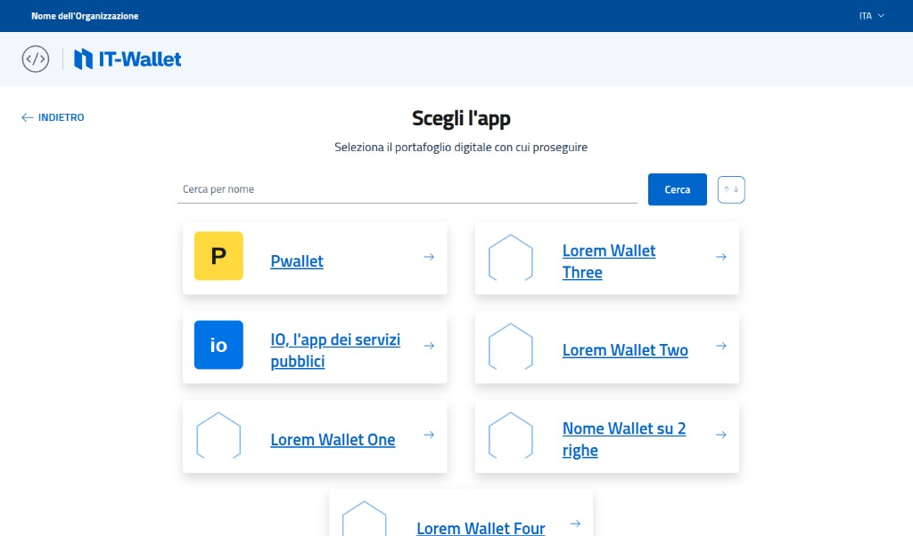

<!-- _class: lead lead-blue lead-title-tight -->
# OpenID Federation 1.0 and EUDIW TL / X.509 PKI in IT-Wallet

A **state of play** on **trust management** in the **Italian IT-Wallet** and how it reads **next to EUDIW**.

**with Giuseppe De Marco**, _Technical Project Manager — Dipartimento per la trasformazione digitale, Presidency of the Council of Ministers of Italy_

---

## Today in 4 parts

0. **OpenID Federation in Italy** — SPID/CIE OIDC vs. IT-Wallet.
1. **OpenID Federation in IT-Wallet** — final alignment with **Federation 1.0**, federation **endpoints**, progresses with **Federation Wallet Architectures**.  
2. **EUDIW trust management** — overview, responsibility matrix, design concerns, domestic gaps.
3. **Costs** — many sources vs one federation chain; dual evaluation paths; participant obligations.  
4. **Evolution** — onboarding APIs, ACME + Federation, OpenID Federation Wallet Architecture draft maturity.

---

## Two trust-evaluation approaches, one ecosystem

- **History:** at IT-Wallet kick-off, **OpenID Federation** was the more **mature, implementable** horizontal trust layer for a **national** federation.  
- **Today:** Federation **1.0** track is definitively **stable**; ARF / TS / LoTE still **move quickly** with evident overlapping devices — reasonable to **integrate European profile pieces where legally required**, without collapsing national federation design.  
- **Strategy:** **incremental convergence** on outputs (what verifiers can prove) rather than forcing one protocol stack everywhere.

---

## Part 0 — Legacy SPID/CIE vs IT-Wallet based **Federation 1.0** (short intro)

The **national IT-Wallet rules** align with **OpenID Federation 1.0** and the **OpenID Federation Wallet Architecture** draft. While pre-1.0 OpenID Federation drafts are used in the the legacy OIDC SPID/CIE profile. 

Two different Federations, using two different Trust Anchors.

OIDC CIE/SPID should be updated with Federation 1.0 (and OIDC iGov too) assuring retrocompatibility to previous implementations.

[spid-cie-oidc-django](https://github.com/italia/spid-cie-oidc-django/pull/324) exemplifies how **retrocompatibility is achievable**.

---

<!-- _class: federation-api-compact -->
## Part 1 — Federation API surface (Trust Anchor / Intermediate)

| API | HTTP | Roles | Norm | Body |
|-----|------|-------|------|------|
| Entity config | `GET /.well-known/openid-federation` | TA,Int,WP,RP,CI | MUST | `entity-statement+jwt` |
| List | `GET …/list` | TA,Int | MUST | JSON |
| Fetch | `GET …/fetch?sub=` | TA,Int | MUST | JWT |
| TM status | `POST …/trust_mark_status` | TA,Int | **OIDF** SHOULD → **IT-W** MUST | JSON |
| TM list | `GET …/trust_marked_list` | TA,Int | **OIDF** MAY → **IT-W** SHOULD | JWT |
| Hist keys | `GET …/historical_keys` | TA,Int | **OIDF** MAY → **IT-W** MUST | JWT |
| Sub events | `GET …/subordinate_events?sub=` | TA,Int | **OIDF** MAY (ext.) | `entity-events+jwt` |
| Resolve | `federation_resolve_endpoint` | any | **OIDF** MAY (§8.3) | — |

- IT-Wallet uses the **Federation Subordinate Events Endpoint** as defined in **`OID-FED-SUBORDINATE-EVENTS`**: [openid-federation-subordinate-events-1_0](https://openid.net/specs/openid-federation-subordinate-events-1_0.html). Purpose: historical **registration / revocation / JWKS update** events for immediate subordinates — transparency for lifecycle and audits (**Federation Subordinate Events** in the **IT-Wallet** trust model).

---

## Part 1 — The remark about Wallet Instances using OpenID Federation

⚠️ **Reminder — Wallet + federation:** 

Wallet Instance **must not** publish discoverable online metadata; federation endpoints are all **public without client credentials** that identify callers.

---

<!-- _class: metadata-delta-matrix -->
## Part 1 — Protocol-specific **metadata**: IT-Wallet vs Federation 1.0

| Role | Metadata (beyond base `OID-FED`) | IT-Wallet / draft note | **`OID-FED-WALLET`** (draft) |
|:-----:|-----------------------------------|------------------------|-------------------------------|
| **Any federation leaf** | **`federation_entity`** | **Required**; **`logo_uri`** = **SVG**; **`contacts`** (e.g. **PEC**) where the profile tightens presentation. Federation base. | **—** |
| **Relying Party** | **`openid_credential_verifier`** | Verifier metadata for **OpenID4VP** / presentation (e.g. attested URIs when `client_id` = **`openid_federation`**) | **Covered** |
| **PID / (Q)EAA provider** | **`openid_credential_issuer`** · **`oauth_authorization_server`** | **Combined** in one **EC** **or** **split**; if split, CI carries **`authorization_servers`** → AS | **Covered** |
| **Wallet Provider** | **`wallet_solution`** + **`federation_entity`** | WP’s **single** Wallet Solution | **Not covered** |

---
<!-- _class: metadata-delta-matrix -->
## Part 1 — Federation Profile delta in **OpenID4VCI** Metadata

| Focus | IT-Wallet / OpenID4VCI rule | Highlights | OpenID alignment |
|:-----:|-----------------------------|------------|------------------|
| **`jwks` by value** | **`openid_credential_issuer`** and **`oauth_authorization_server`** MUST publish **`jwks`** **by value** (not reference-only) | National **credential issuer metadata** profile; **`OID-FED`** §5.2.1 / **`JWK`** | **Covered by `OID-FED-WALLET`** |
| **`trust_frameworks_supported`** | **REQUIRED** (national issuer profile) | Declares frameworks used in the **authorization** flow (e.g. CIE, eIDAS, L2+) | **Covered by `OID-FED-WALLET`** |
| **`schema_id` / `authentic_sources`** | **REQUIRED** per–credential configuration | National **schema** + **authentic-source** registries | **Covered by `OID-FED-WALLET`** |
| **`status_list_aggregation_endpoint`** | **REQUIRED** where the profile mandates | **Token Status List** aggregation for credential / token status | **Covered by OpenID4VCI** |
| **SVG-first issuer / credential display** | **REQUIRED** where the profile mandates | **Display** / artwork rules for issuer and credentials | **Covered by OpenID4VCI** |
| **`batch_credential_issuance`** (+ **`batch_size`**) | **OPTIONAL** | Advertise **batch** issuance when supported | **Covered by OpenID4VCI** |

---
<!-- _class: metadata-delta-matrix -->
## Part 1 — Federation Profile delta in **OpenID4VP** Metadata

| Topic | Metadata / behaviour | IT-Wallet & alignment | OpenID specs coverage |
|:-----:|------------------------|----------------------|----------------------------|
| **Attested URIs** (`client_id` = **`openid_federation:`**) | **`openid_credential_verifier`** lists **`request_uris`**, **`response_uris`**, **`redirect_uris`** (pre-registered) → wallet rejects **endpoint mix-up** | Satisfied. **`WP_081`**, **`WP_091a`**, **`WP_094a`**; remote-presentation test matrix | **OpenID4VP** verifier metadata; **`OID-FED-WALLET`** (draft) attested URI model (aligned checks) |
| **`x509_hash:` path** | Same semantics via **`client_metadata`** carried **in the request** (not federation verifier URI lists) | Satisfied | **OpenID4VP** `client_id` prefix **`x509_hash:`** + in-band **`client_metadata`**; national **`remote-flow`** narrows behaviour |
| **Encrypted VP response** | **`encrypted_response_enc_values_supported`** for **`direct_post.jwt`** | Satisfied | **OpenID4VP/HAIP** (encrypted authorization response path) |
| **Verifier `logo_uri`** | **`logo_uri`** as **SVG** | National **`openid_credential_verifier`** presentation rules | **OpenID4VP** verifier **display** metadata |
| **`erasure_endpoint`** | **Conditional** verifier metadata when the RP requests **strongly identifying** claims | **IT-Wallet–specific** RP / credential-verifier extension | **Outside OpenID4VP core** as a **universal** field — **national** profile add-on |

---

<!-- _class: wallet-selection-screenshot -->
## Part 1 — Wallet solution selection & custom URI mitigation

- **UX:** national proxy **wallet selection** preview — [iam-proxy-italia IT-Wallet](https://italia.github.io/iam-proxy-italia/preview/sec-fix-3.2.1/it-wallet.html).  
- **Security:** custom **`scheme://`** invocation risks **phishing** / **handler clash**; prefer **HTTPS picker** on a **known origin** + **app/universal links** where possible — **custom-URI fallbacks** remain **typosquatting**-sensitive.  
- **Scale-out:** many subordinates may need **bulk / paged listing** beyond `federation_list_endpoint` — draft [Extended Subordinate Listing 1.0](https://openid.net/specs/openid-federation-extended-listing-1_0-01.html).

---

<!-- _class: lote-trust-overview -->
## Part 2 — EUDIW uses an Hierarchical authoritative listing model

Participants register nationally; **CIRs**/**IETF**/**ARF** describe who publishes what (PID TL at EC, many wallet-provider / WRPAC lists, sector-specific registration artefacts, …).

**List of Trusted Lists**/**trusted lists**/**LoTE** represent this articulated division of responsibilities.

*Diagram: **dotted** arcs — LoTL **indexes** LoTE-family lists; **solid** path — MS **TSL** feeds LoTL. **Normative refs** (versions, CIR, ARF) are in the **figure legend** (Mermaid).*

---

<!-- _class: responsibility-recap-slide -->
## Part 2 — Responsibility matrix (recap)

| Role | Registration | TL / LoTE publication | Notes |
|------|----------------|----------------------|--------|
| PID Provider | MS registrar | **EC** EU PID TL | MS TLP not compiler for EU PID TL |
| EAA / QEAA | MS registrar | MS national TLs; **PuB-EAA** via **EC** TL | Several list “surfaces” |
| Wallet Provider | notification MS→EC | **EC** wallet-provider TL | Operational evaluation at EC side |
| WRP / WRPAC / WRPRC | registrar vs notification | mix of **MS** APIs + **EC** LoTE | RP registration API (ARF Tech Spec 5) |

---

<!-- _class: design-pressure-matrix -->
## Part 2 — Design pressure & trusted-list singularities (matrix)

| Area | Mechanism | Impact |
|:-----:|-----------|--------|
| **Multi-role duplication** | One entity, **several operational roles** ⇒ **separate TL/LoTE appearances**; artefacts in **JSON and XML** (**602 / 612**) | **Duplicate checks**; **no safe dedupe** by corporate identity; **dual parser / policy** paths |
| **Verifier load** | Trust evidence **across TL/LoTE**, **status** APIs, **registration**, **federation** metadata | **Wallets & RPs** must **resolve and correlate** many sources at issuance **and** presentation |
| **Trust drift** | **Independent** publish / revoke cadences, caches, CDNs | Same subject can appear **trusted in one list view, stale or revoked in another** |
| **WSCD** | Assurance stops at the **device / hardware** boundary | **Non-repudiation** claims are **bounded** |
| **Registration graph** | **MS vs EC** roles; notification vs full registration | Not a **single TL hop**—orchestration is a **graph** of steps |
| **Domestic vs EC lists** | **PID / PuB-EAA / Wallet** provider TLs **hosted at EC**; MS may still add **parallel national** lists or flows | Verifiers **branch** on **domestic** vs **cross-border** list sets; **no single uniform TL cloud** |

---

## Part 2 — Domestic gap & Italian choice

- **EC-hosted lists** (PID, Pub-EAA, Wallet Provider, WRPAC, …) **do not** map 1:1 onto **national-only** trust needs: Member States remain free to operate **additional** national infrastructures.  
- **Italian approach:** keep **OpenID Federation** as the **national, JWT-first trust plane** for wallet ecosystem participants, while **EUDIW ARF / TL obligations** are satisfied where mandated (X.509 access certs, EC lists, registrar APIs) — **avoid forcing one technology to emulate the other**.  
- **Implication:** full “harmonisation” into a single mechanism is **not** pursued; **interworking** and **clear client signalling** matter more:
  - **`client_id_prefixes_supported`**: **`openid_federation`** vs **`x509_hash`** — two ways the verifier knows which trust machinery applies.
  - **`openid_federation:`** prefix ⇒ the **federation trust chain** and entity configuration **`sub`** must match the presented identifier.
  - **`x509_hash:`** prefix ⇒ the hash of the **RP access certificate** **`x5c`** (per national **access** rules and **LoTE of Access**) must match the embedded hash (**bound by reference**).

---

## Part 3 — Cost lens: multiplicity vs federation chain

- **EUDIW path:** presentation may touch **TLS / access cert**, **OCSP/CRL**, **one or more registration certificates**, **several status lists / registry APIs**, **discovery** — **five-ish trust surfaces** before app logic.  
- **OpenID Federation path:** one **trust chain** of signed statements + optional trust marks + historical JWKS + policieis + **subordinate events**.  
- **Critique:** duplicated **revocation / freshness** semantics across X.509 and JWT worlds if both are always evaluated -> **rule:** once an X.509 is issued its lyfecyle is handled using PKIX tools and not openid federation API.
- **Mitigation for RPs:** choose **`x509_hash`** presentation where acceptable to **reuse X.509-heavy verifier patterns** from EUDIW discussions and **trim live federation fetches** on the hot path (still subject to national profile rules).

---

## Part 4 — X.509 Issuance

- **Today:** parts of onboarding lean on **custom / national APIs** and registries (not a single OIDF profile) for automated X.509 issuance.
- **Current state:** national **access / federation entity X.509** processes are not standardized yet, compared with commodity ACME automation.  
- **IETF direction:** [draft-ietf-acme-openid-federation](https://datatracker.ietf.org/doc/draft-ietf-acme-openid-federation/) — bind ACME issuance to federation entity identifiers to **reuse ACME clients** instead of one-off custom enrollment APIs (cost reduction for participants, relying on already available ACME client implementation).

---

## Part 4 — Onboarding API still not proposed for standardization

- **Possible direction (idea):** analogous to **OIDC Dynamic Client Registration**, a **federation-scoped registration draft** could register an entity **with the federation authority**, not with a single OP — *discussion for standards*, not a commitment.

FBK, IPZS, Mike ... is there space for that?

---

## Part 4 — OpenID Federation *Wallet Architectures* (draft)

- **`OID-FED-WALLET` remains a draft** — Italy intends to **harden practice first** and **feed evidence into standardisation**, rather than rushing **optional or underspecified** features before they are **operationally validated**.

---

## Part 4 — Trust proxies

- **No appetite (today) for “trust proxies”** that would call Federation APIs to **re-evaluate foreign TLs / revocations** on behalf of wallets: risks include **privacy** (who is probed), **SPoF**, and **trust drift** when proxy caches diverge from wallet-local policy / TTLs.

---

<!-- _class: lead lead-blue thank-you-slide -->
# Thank you

**Questions?**

<a href="https://peppelinux.github.io/Wallet-Presentations/">peppelinux.github.io/Wallet-Presentations/</a>

