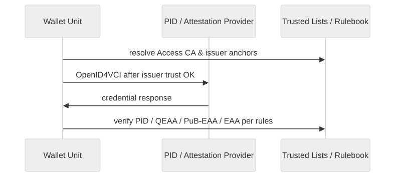
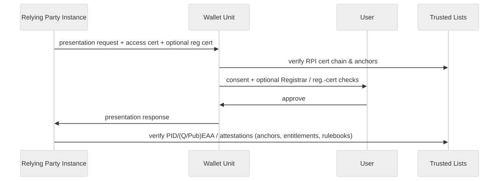

<!-- _class: lead lead-blue -->
# 1. Trust management in the EUDI Wallet ecosystem

**~12 minute overview with Giuseppe De Marco**, _Technical Project Manager - Dipartimento per la trasformazione digitale, Presidency of the Council of Ministers of Italy_

---

<!-- _class: agenda -->
## 2. eIDAS Trust Infrastructure Topics

1. **Awareness**... Trust management is a cross-cutting concern  
2. **Governance**: Member States, European Commission, Certification Bodies, Standardization Bodies, Specific Sector Schemes
3. **Framework**: eIDAS uses an _Authoritative Listing_ with PKI continuity and specific purpose extensions  
4. **Enrollment**: registrars, accreditation, certification, notification mechanisms, activation of participants through publication within the Authoritative Lists (Trusted Lists)
5. **Runtime**: digital signature, timestamps, issuance, presentation, user-visible assurance  
6. **Assurance & lifecycle**: certification, Trust Mark, revocation  

<i>Both Trust and Scalability are about <strong>risk</strong> and <strong>cost reduction</strong>, a Trust that scales compounds its value!</i>

---

<!-- _class: compact-takeaways -->
## 3. Specification counts vs trust requirements (order of magnitude)

| What we count | Specifications |
| --- | ---: |
| **ARF main document** — each **own row** in the *References* table for a standard or protocol (ISO, ETSI, RFC, W3C, OIDF, …); **excludes** EU acts/CIRs and Topic links | **44** |
| **`docs/technical-specifications/`** — EC Wallet TS1–TS11 | **11** |
| **Public STS roadmap** (GitHub tracker; see `docs/technical-specifications/README.md`) | **~200** items under watch; a smaller **essential** subset for the Wallet |

---

<!-- _class: eidas-distributed-slide -->
## 4. eIDAS: national registration → EU lists → runtime verifiers

Many independent **actors**. 
No EU-wide single “login authority”.  
Shared rule and semantics inside the same interoperability patterns.

1. **Participants Enrolling / Onboarding / Registration**
2. **Notification** to the Root of Trust, the EU Commission
3. **Publication** and Participants **lifecycle**
4. **Usage**, mutual trust evaluation
5. **Dispute resolution** and regulated administrative security framework

Trust is the product of framework establishing registration, crypto,
published anchors and supervision.

---

<!-- _class: responsibilities-matrix -->
## 5. eIDAS Trust Infrastructure Responsibilities matrix

Trust evaluation depends on both who registers and who publishes.

| Entity type | Registration | TL compilation (EC / MS TLP) | MS TLP role |
|-------------|----------------|------------------------------|-------------|
| **PID Provider** | MS **Registrar** | **European Commission** (EU PID TL) | None |
| **Attestation Provider** | MS **Registrar** | **MS TLP**: QTSP TL (QEAA); national TL (non-qualified EAA); **PuB-EAA** → **EC** TL | Compiles / signs / publishes national TLs; notifies EC |
| **Wallet-Relying Party** | MS **Registrar** | **N/A** (WRPAC; **not** EC/MS TL) | **MS** runs national registry + **ARF TS5** machine-readable format & API |
| **Wallet Provider** | *Notification only* (MS → EC) | **European Commission** | Evaluates certification and compliances |
| **WRPAC Provider** | *Notification only* (MS → EC) | **European Commission** (WRPAC / Access CA LoTE) | None (MS notifies EC; **no** MS TL for this role) |
| **WRPRC Provider** | *Notification only* (MS → EC) | **European Commission** (Provider of reg. certs LoTE) | None (MS notifies EC; **no** MS TL for this role) |

---

<!-- _class: why-matters -->
## 6. Does everything fit within it?

- **Duplication**: one **entity** playing multiple roles (QEAA+PubEAA Provider+RP) requires **separate trusted-list appearances**, **revocations** must stay consistent everywhere.
- **Verifier burden:** the Wallets/RPs must **resolve identity across different lists**. Possible **trust drift**.
- **Domestic Gaps:** PID/PubEaa/Wallet Solutions Trusted Lists are only hosted by EC, MS may implement other approaches. 

---

<!-- _class: wallet-spotlight -->
## 7. Wallets under the spotlight

**Wallet Providers** **provide** one/more **Wallet Solution(s)**. Each **Holder** (Wallet User) use a **Wallet Instance**, this includes **Wallet Unit** along with **WSCA/WSCD**, and **keystores** for non-critical crypto. **Wallet Unit Attestation (WUA)** and **Wallet Instance Attestation (WIA)** are presented to **PID / Attestation Providers** when requesting a PID or attestations.

---

<!-- _class: wscd-split -->
## 8. WSCD trust evaluation challenges

- EC Trusted Lists contain **Wallet Providers**, not each single **WSCD** Trust Anchor.
- **WUA** = signed **certification** evidences, and **public cryptographic keys**, to be included in PID/EAA. Credential Issuers **checks** on their own according to associated WUA certification schemes, not a **Trusted List per chip**. **No** central, verifiable, WSCD vendor list.

---

<!-- _class: compact-graph -->
## 9. A Fragmented Policy Framework

- **Registration Certificates**: **MS Registrar** may issue **registration certs** (**TS 119 475**) **or** **Embedded Policies** (**TS 119 472-3** Metadata members **`entitlement`** / **`providesAttestations`** not defined in OpenID). **RP** presentation may hint, only **Registrar RP API** is authoritative.
- **PID / Attestation Providers**: **TL** + **LoTE** — notified **who** may issue and **trust anchors**.
- **Registrar policy is national**: each **Member State** runs **its own** Registrar **rules**—**no** EU **central authority** that issues or harmonises those **registration policies**.
- **No shared “domestic” compliance across MS**: policies and safeguards anchored in **one** Registrar **do not** make an actor **automatically compliant** with **another** MS’s Registrar regime; beyond **common specs** (ARF, TS, legal acts), there is **no** single **ecosystem-wide** **protection** or procedural baseline.

---

<!-- _class: registration-graph -->
## 10. A Fragmented Policy Framework

---

## 11. Overengineering: many trust sources for one relying party

**RPs** force wallets to juggle on the **presentation** path along with **five distinct trust sources**.

| # | Surface | Example |
|---|---------|--------|
| **1** | **Protocol / transport trust** | **One** RP **access** (or TLS) **certificate** — path validation against **RP Access CA** trusted material. |
| **2** | **Revocation / freshness** | **One** (or few) **revocation endpoints** — **OCSP/CRL** (or stapled) so the access cert is still **valid now**. |
| **3** | **Registration / entitlement** | **N registration certificates** — possibly **several** for attributes, scopes, or sector registers. |
| **4** | **Status of those registrations** | **Multiple status lists** (or status services) — **WRPRC**, sector lists, **Registry** snapshots — not one check. |
| **5** | **Discovery API** | **One registration API** (or **Registry**) to **resolve** what the RP is allowed to ask when something is not in-band. |

---

<!-- _class: compact-graph -->
## 12. Pre-existing trust frameworks & sector-specific stacks

**Already familiar (eIDAS / ARF continuity)**

- **Legal**: **EUDI** amends **eIDAS**; **qualified artefact paths** still use **QTSPs**, **qualified certs**, **EU trusted lists / TSP**.
- **Technical** (**§6.1**): **X.509** for PID, QEAA, PuB-EAA, access/registration certs; wallet lists follow **TS 119 612 / LoTL** (same family as trust-service lists).
- **Deployment**: Member States may use **several CAs** or **reuse** national PKI / practice as **Access CA** / **Registrar**.
- **Non-qualified EAA** can follow **other trust models** (not only EU-wide PKI lists).

**What’s still thin:** the **core** picture is **eIDAS TLs / LoTL + ARF rulebooks + registers** — yet **many wallet-relevant sectors** already run **parallel trust infrastructures** (e.g. **banking**, **eProcurement / eInvoicing**, **G2G evidence reuse**, **data spaces**) with **their own** CAs, registers, status services, and APIs.

- **WE BUILD / WP4** is spelling out how those worlds **map** into the Trust Infrastructure (TL / trust-anchor patterns, rulebooks, registry or API bridges) — see **Peppol PKI**, **OOTS**, **iSHARE**: [wp4-trust-group#73](https://github.com/webuild-consortium/wp4-trust-group/issues/73).  
- **Gap:** without **explicit** per-sector integration, implementations risk **duplicated validation**, **extra round-trips**, and **opaque** “which list wins?” behaviour.

---

## 13. Sector bodies & attestation schemes

- **Attestation Scheme Providers** publish **Rulebooks** (+ **machine-readable schemes** in the catalogue). Besides the **Commission** (e.g. PID, mDL), ARF §5.4.2 allows **public administration, sectoral or cross-border organisations**—so e.g. education/health/mobility communities define **shared semantics** and **type-specific trust/presentation rules** without duplicating formats.
- The **Commission** still **operates the catalogues** (attributes + schemes, **TS11**); **Trusted Lists** remain the anchor for **who** may issue—**catalogue listing does not force acceptance** or automatic **cross-border recognition** (§5.5.3).
- **PuB-EAA** ties issuance to an **Authentic Source** (national/sector **data root**); the **responsible public-sector body** and **conformity** rules apply as in the Regulation / ARF §3.7.

---

## 14. Certification, Trust Mark, supervision

- **NAB → CAB** accreditation; **CAB** certifies **wallet solutions** and audits **QTSPs**. **Supervisory bodies** oversee ecosystem actors. **Trust Mark** links UI to **Commission** certification info.

---

## 15. Trust when **issuing** credentials

- **Before request**: issuer **access cert**, **registration** / **Registrar**, **entitlement** to credential type. **After receipt**: verify **signature** (lists + law for qualified; **Rulebook** for non-qualified EAA).

---

## 16. Trust when **presenting** to relying parties

- **RPI** proves itself with **access cert**; wallet trusts **RP Access CA** lists. **RP** verifies presented credentials like the wallet. User can compare **request vs Registrar** (**Topics 44, 6**).

---

## 17. Lifecycle: suspension, cancellation, revocation

- **List updates**, **cert revocation**, **WUA revocation** (**Topic 38**). PID provider checks **who may request** wallet revocation (**WURevocation_12**).

---

## 18. Wallet discovery — cost, complexity & timing

**Wallet Instance** view (*policy discovery & trust evaluation*, WP4 `eudi-wallet-trust-and-entitlement-discovery.md`):

| Topic | Baseline / What you must do | Gets harder when… |
|--------|----------------------------|-------------------|
| **Network** | **LoTL**→**TSL**; **OCSP/CRL** (WRPAC); **Registry** if **no WRPRC** in request; **WRPRC** status-list; issuance repeats issuer **WRPAC/WRPRC** + TL | **Cold** cache; **foreign TSL** + Registry; **+1 RT** if WRPRC **pulled** from Registry; **multi-register** / sector RPs |
| **Cache / offline** | Cached TSL to `NextUpdate` (**TS 119 612** §5.3.15) | First run, expired cache, **pivot LoTL**/OJEU; **offline** → cached-only or **reject** (doc §7.2) |
| **Build & policy** | X.509+**SCT**; **JWT/CWT WRPRC** vs **WRPRC Provider** LoTE; **RPRC_21**; multi-register §2.4; UX §4.3 | **CRL-only**; **uncovered** attrs **RPA_10a**; **two** flows issuance vs presentation (§2.1 vs §2.2) |
| **Consent window** | All trust steps **before/during** **RPA_07** | Slow Registry/TLP → **§4.3.2** degradation |

**Planning (non-normative):** expect **several** sequential deps on the happy path—**parallelize** independent work (e.g. OCSP while parsing TSL); model a **state machine** (**WRPRC** in-band / **Registry** / **multi-WRPRC**) with **explicit degradation**; cost scales with **register count** and **entitlement strictness**, not crypto alone.

---

<!-- _class: compact-takeaways -->
## 19. Takeaways

- **Trust is layered**: **TL/LoTE** for who is notified; **Registrar + TS5** for RP entitlements; **WUA** (not a chip-per-row list) for wallet crypto assurance.
- **Policy is fragmented**: **national Registrar** rules; **no** EU registrar-policy monoculture; **metadata + certs** (ETSI/OpenID stack) carry issuer scopes beside publication.
- **Wallet discovery has real cost**: **LoTL/TSL**, revocation, Registry, **WRPRC** branches—design for **cache**, **parallel fetch**, and **graceful degradation**.

---

<!-- _class: lead lead-blue -->
# 20. Thank you

**Questions?**

---

<!-- _class: lead lead-blue -->
# 21. Giuseppe De Marco

**Technical Project Manager** — _Dipartimento per la trasformazione digitale_, Presidency of the Council of Ministers of Italy

_ITU Workshop — Trustable and Interoperable Digital Identities for Human and Agentic AI — Geneva, 30–31 March 2026_
