<!-- _class: lead lead-blue -->
# Trust management in the EUDI Wallet ecosystem

**~12 minute overview with Giuseppe De Marco**, _Technical Project Manager - Dipartimento per la trasformazione digitale, Presidency of the Council of Ministers of Italy_

---

<!-- _class: agenda -->
## eIDAS Trust Infrastructure Topics

1. **Awareness**... Trust management is a cross-cutting concern  
2. **Governance**: Member States, European Commission, sector schemes
3. **Framework**: eIDAS uses an _Authoritative Listing_ with PKI continuity and specific purpose extensions  
4. **Enrollment**: registrars, accreditation, certification, notification mechanisms, activation of participants through publication within the Authoritative Lists (Trusted Lists)
5. **Runtime**: digital signature, timestamps, issuance, presentation, user-visible assurance  
6. **Assurance & lifecycle**: certification, Trust Mark, revocation  

<i>Trust is about <strong>risk</strong> and <strong>cost reduction</strong>, a common infrastructure works when it <strong>scales</strong>.</i>

---

<!-- _class: eidas-distributed-slide -->
## eIDAS: national registration → EU lists → runtime verifiers

Many independent **actors**. 
No EU-wide single “login authority”.  
Shared rule and semantics inside the same interoperability patterns.

1. **Participants Enrolling / Onboarding / Registration**
2. **Notification** to the Root of Trust, the EU Commission
3. **Publication** and Participants **lifecycle**
4. **Usage**, mutual trust evaluation
5. **Dispute resolution** and regulated administrative security framework

Trust is the product of framework establishing registration, crypto,
published anchors and supervision.

---

<!-- _class: responsibilities-matrix -->
## eIDAS Trust Infrastructure Responsibilities matrix

Trust evaluation depends on both who registers and who publishes.

| Entity type | Registration | TL compilation (EC / MS TLP) | MS TLP role |
|-------------|----------------|------------------------------|-------------|
| **PID Provider** | MS **Registrar** | **European Commission** (EU PID TL) | None |
| **Attestation Provider** | MS **Registrar** | **MS TLP**: QTSP TL (QEAA); national TL (non-qualified EAA); **PuB-EAA** → **EC** TL | Compiles / signs / publishes national TLs; notifies EC |
| **Wallet-Relying Party** | MS **Registrar** | **N/A** (WRPAC; **not** EC/MS TL) | **MS** runs national registry + **TS5** machine-readable format & API |
| **Wallet Provider** | *Notification only* (MS → EC) | **European Commission** | N/A |
| **WRPAC Provider** | *Notification only* (MS → EC) | **European Commission** | N/A |
| **WRPRC Provider** | *Notification only* (MS → EC) | **European Commission** | N/A |

---

<!-- _class: why-matters -->
## Does everything fit within it?

---

<!-- _class: compact-takeaways -->
## Specification counts vs trust requirements (order of magnitude)

**SDO** = *Standards Developing Organisation* (ETSI, ISO/IEC, IETF, W3C, CEN, …). **Specification** = a named standard, RFC, or technical spec document — not a legal act and not an ARF “Topic …” link.

| What we count | Specifications |
| --- | ---: |
| **ARF main document** — each **own row** in the *References* table for a standard or protocol (ISO, ETSI, RFC, W3C, OIDF, …); **excludes** EU acts/CIRs and Topic links | **44** |
| **`docs/technical-specifications/`** — EC Wallet TS1–TS11 | **11** |
| **Public STS roadmap** (GitHub tracker; see `docs/technical-specifications/README.md`) | **~200** items under watch; a smaller **essential** subset for the Wallet |

---

## Wallet Unit at the centre

- **Wallet Solution** = Instance + **WSCA/WSCD** + keystores; **WUA / WIA** prove the wallet to **issuers** before PID or attestation delivery.

---

<!-- _class: tl-split -->
## Trusted lists and the Commission

| Layer | Role |
|-------|------|
| **Member States** | Notify entities; national registries and approval policies. |
| **Commission** | Specs, validation, **Trusted Lists**, **LoTL**, OJEU. |
| **Publication** | Signed/sealed lists → **trust anchors** for verifiers. |

---

<!-- _class: wscd-split -->
## WSCD assurance vs “another Trusted List”

- **Lists name Wallet Providers**, not each **WSCD**: trust via **WUA** + provider anchor (**§6.6.2.3.1**, **TS3**); WUA states **WSCA/WSCD** (or keystore) facts.
- **WUA** = signed **certification**, **keys**, and (PID) **binding** of PID material to that WSCD (**§6.6.2.3.2–3.3**). **LoA High** → PID Provider **checks** those claims — not a **LoT row per chip**.
- **PID Providers**: supported Wallet LoTEs only. **Attestation Providers**: **every** certified wallet (**§6.6.2.3.1**); **no** central WSCD vendor list.

---

<!-- _class: compact-graph -->
## Pre-existing trust frameworks

- **Legal**: **EUDI** amends **eIDAS**; **qualified artefact paths** still use **QTSPs**, **qualified certs**, **EU trusted lists / TSP**.
- **Technical** (**§6.1**): **X.509** for PID, QEAA, PuB-EAA, access/registration certs; wallet lists follow **TS 119 612 / LoTL** (same family as trust-service lists).
- **Deployment**: Member States may use **several CAs** or **reuse** national PKI / practice as **Access CA** / **Registrar**.
- **Non-qualified EAA** can follow **other trust models** (not only EU-wide PKI lists).

---

<!-- _class: compact-graph -->
## Registration & “who may do what”

- **MS policy** → **Registrar** → **registry**; optional **registration certificates** encode **scopes** (attributes, use, attestation types).

---

## Sector bodies & attestation schemes

- **Attestation Scheme Providers** publish **Rulebooks** (+ **machine-readable schemes** in the catalogue). Besides the **Commission** (e.g. PID, mDL), ARF §5.4.2 allows **public administration, sectoral or cross-border organisations**—so e.g. education/health/mobility communities define **shared semantics** and **type-specific trust/presentation rules** without duplicating formats.
- The **Commission** still **operates the catalogues** (attributes + schemes, **TS11**); **Trusted Lists** remain the anchor for **who** may issue—**catalogue listing does not force acceptance** or automatic **cross-border recognition** (§5.5.3).
- **PuB-EAA** ties issuance to an **Authentic Source** (national/sector **data root**); the **responsible public-sector body** and **conformity** rules apply as in the Regulation / ARF §3.7.

---

## Certificates and transparency

- **Access certs** authenticate protocol endpoints; **registration certs** prove **registered identity & entitlements** (where issued). **SCT** on access certs (**Topic 55**).

---

## Trust when **issuing** credentials

- **Before request**: issuer **access cert**, **registration** / **Registrar**, **entitlement** to credential type. **After receipt**: verify **signature** (lists + law for qualified; **Rulebook** for non-qualified EAA).

---

## Trust when **presenting** to relying parties

- **RPI** proves itself with **access cert**; wallet trusts **RP Access CA** lists. **RP** verifies presented credentials like the wallet. User can compare **request vs Registrar** (**Topics 44, 6**).

---

## Certification, Trust Mark, supervision

- **NAB → CAB** accreditation; **CAB** certifies **wallet solutions** and audits **QTSPs**. **Supervisory bodies** oversee ecosystem actors. **Trust Mark** links UI to **Commission** certification info.

---

## Lifecycle: suspension, cancellation, revocation

- **List updates**, **cert revocation**, **WUA revocation** (**Topic 38**). PID provider checks **who may request** wallet revocation (**WURevocation_12**).

---

## Wallet-unit discovery — cost, effort, timing

From a **Wallet Instance** perspective (*policy discovery & trust evaluation*, WP4 `eudi-wallet-trust-and-entitlement-discovery.md`):

| Aspect | What drives it |
|--------|----------------|
| **Network / latency** | **LoTL** → one or more **TSL fetches**; **OCSP/CRL** for WRPAC; optional **Registry** API (if no WRPRC in request); **WRPRC status-list** HTTP; issuance path repeats TL + revocation for **issuer** WRPAC/WRPRC. |
| **Steady-state vs cold** | **Cached TSL** until `NextUpdate` (TS 119 612 §5.3.15) lowers amortized cost; **first run / expired cache** = full chain; **offline**: cached-only or **reject** (doc §7.2). |
| **Implementation effort** | X.509 path validation + **SCT** checks; **JWT/CWT** WRPRC verification against **WRPRC Provider** TL; **entitlement** parsing & **RPRC_21** attribute allow-list; **multi-register** aggregation & conflict rules (§2.4); UX for **uncovered** attributes & **user default policy** (§4.3). |
| **User-perceived timing** | All trust steps run **before / during** consent (**RPA_07**); slow or failing Registry/TLP **blocks or degrades** to user-only policy (§4.3.2). |

**Order-of-magnitude (implementation planning, not normative):** expect **several sequential network dependencies** on the “happy path”; design **parallel fetch** where independent (e.g. OCSP while parsing TSL); **+1 round-trip** when WRPRC must be **pulled from Registry**; **multi-sector** RPs add **register queries** per applicable register.

---

## Complexity evaluation (wallet-side discovery)

| Factor | Lower complexity | Higher complexity |
|--------|------------------|-------------------|
| **Counterparty** | RP presents **WRPRC in-band**; single MS register | **No WRPRC** → Registry + possible **sectoral / cross-border** registers |
| **Trust material** | Cached **LoTL/TSL**; stapled OCSP | Cold cache; **CRL** only; **pivot LoTL** / OJEU rotation |
| **Policy** | All requested attrs **in WRPRC** | **Uncovered** attrs → **user-autonomous** flow + logging (**RPA_10a**) |
| **Cross-border** | Same MS as wallet’s cached TSL set | **Foreign TSL** + possibly foreign Registry endpoints |
| **Issuance vs presentation** | Reuse one **TL validation stack** | **Two** flows (§2.1 vs §2.2) with different metadata surfaces |

**Engineering takeaway:** treat discovery as a **state machine** with **branching** (WRPRC present / Registry / multi-WRPRC) and **explicit degradation** (offline, WRPRC unavailable); complexity scales with **number of registers** and **strictness** of entitlement checks, not only PKCS#7/COSE crypto.

---

<!-- _class: compact-takeaways -->
## Takeaways

- Trust is **layered**: **policy + registration + lists + certificates + transparency + UI**. No single operator — **common formats**, **notification**, and **verification rules** bind the EU perimeter.
- **ARF Annex 2 HLRs “about trust”:** repo extract `docs/development-issues/trusted-list-registration-trust-evaluation-matrix.md` — **133 unique** requirement IDs (trusted lists, registration, trust evaluation; matrix cites **ARF v2.7.3** Annex 2).
- **Those 133 IDs, grouped by primary purpose** (each ID counted once; briefing partition — see matrix for the authoritative list):

| Purpose | # HLRs |
|---------|-------:|
| **Credential signature verification** (PID / QEAA / PuB-EAA / EAA — Trusted List or Rulebook anchors) | **8** |
| **Party authentication & evidence** (issuer & RP **access** / **registration** certs, ACA / RP-CA **Trusted Lists**, **SCT** on access certs) | **17** |
| **Wallet Provider notification & WUA** (trust anchors for WUA, lifecycle incl. WUA revocation / PID-driven checks) | **11** |
| **Access CA policy & Certificate Transparency** (common CP, logging, monitors, SCT issuance, CA suspension) | **13** |
| **Member State registration & vetting** (registries, APIs, confidence level, suspension policies, access-cert profile) | **23** |
| **Registration certificates** (Commission CP & TS, contents, binding to RP instances, wallet **RPRC** checks) | **26** |
| **Intermediaries** (register, evidence, presentation request shaping) | **7** |
| **Commission: notify, compile, publish Trusted Lists** (GenNot / TLPub + per–participant-type notification & list formats) | **28** |
| **Total** | **133** |
